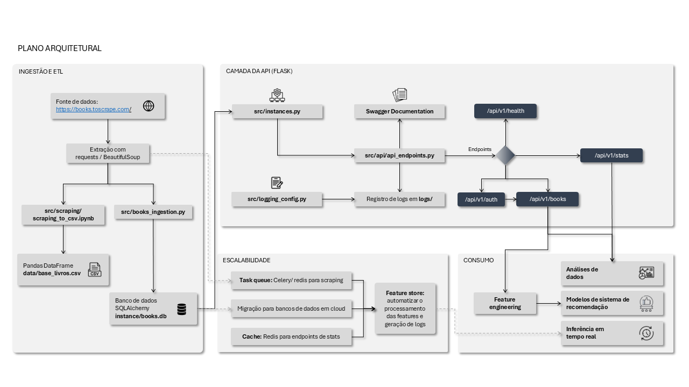
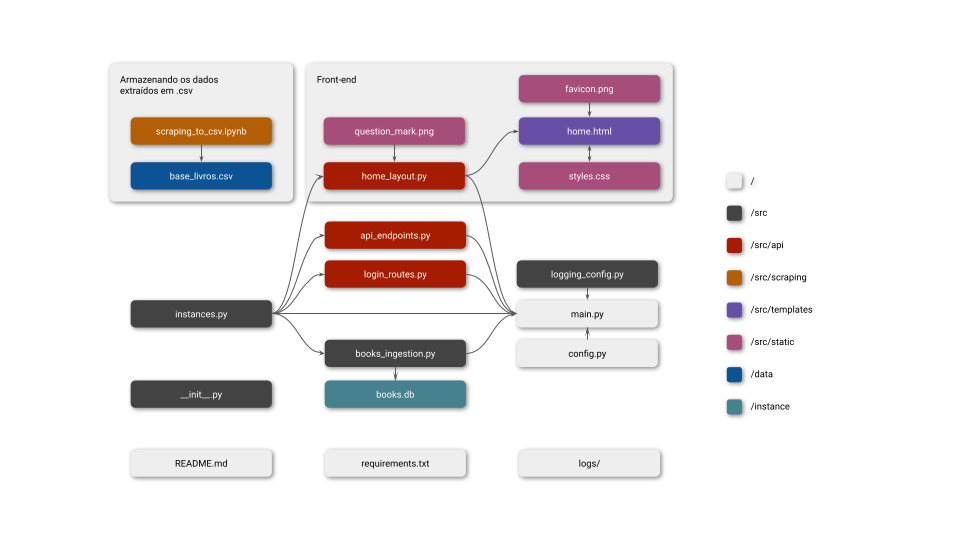
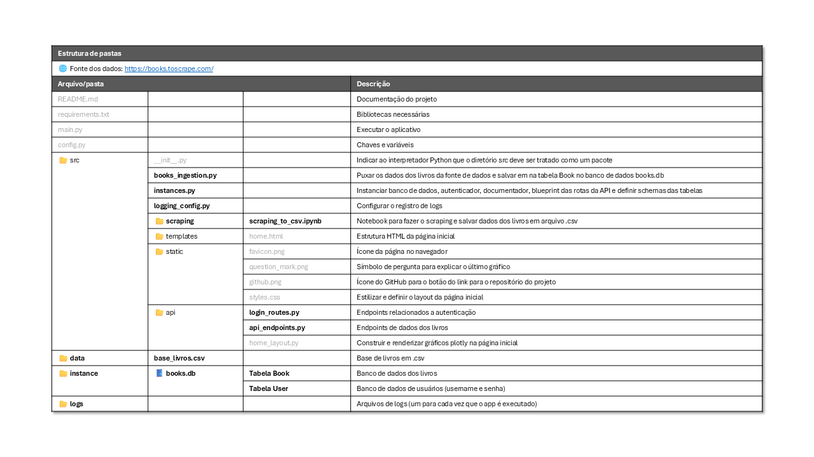

# API para consulta de livros
*Tech Challenge da Fase 1 do curso de [pós-graduação em Engenharia de Machine Learning FIAP](https://postech.fiap.com.br/curso/machine-learning-engineering/)*

## ✨ Sobre o projeto
Este aplicativo é uma **API pública** que permite alimentar sistemas de recomendação de livros. A infraestrutura foi projetada para **extrair, transformar e disponibilizar dados** de livros de forma escalável e reusável, atendendo às necessidades de cientistas de dados e modelos de Machine Learning (ML).

## ⚙️ Funcionalidades:
- ~**Autenticação básica:** Protege rotas sensíveis usando autenticação HTTP básica~
- **Operações CRUD:** Permite criar e ler itens
- **Web Scraping:** Extrai os dados dos livros (título, preço, rating, disponibilidade, categoria, imagem) do site [Books to scrape](https://books.toscrape.com/) e armazena em dois formatos: `.csv` e em banco de dados SQLAlchemy
- **Documentação:** Obtida automaticamente com Swagger

## 📐 Arquitetura



## 📂 Estrutura do projeto
```
books-api/
├── README.md
├── requirements.txt
├── main.py
├── config.py
├── src/
│   ├── __init__.py
│   ├── books_ingestion.py
│   ├── instances.py
│   ├── logging_config.py
│   ├── scraping/
│   │   └── scraping_to_csv.ipynb
│   ├── templates/
│   │   └── home.html
│   ├── static/
│   │   ├── favicon.png
│   │   ├── github.png
│   │   ├── question_mark.png
│   │   └── styles.css
│   └── api/
│       ├── api_endpoints.py
│       ├── login_routes.py
│       └── home_layout.py
├── data/
│   └── base_livros.csv
├── instance/
│   └── books.db
└── logs/
```


## 🧭 Rotas da API (Endpoints)

A API de recomendação de livros expõe os seguintes endpoints:

| Endpoint                                                     | Descrição                                                     |
| :----------------------------------------------------------- | :------------------------------------------------------------ |
| `GET /api/v1/books`                                          | Lista todos os livros disponíveis na base de dados.           |
| `GET /api/v1/books/price-range?min={min}&max={max}`          | Filtra livros dentro de uma faixa de preço específica.        |
| `GET /api/v1/books/search?title={title}&category={category}` | Busca livros por título e/ou categoria.                       |
| `GET /api/v1/books/top-rated`                                | Lista os livros com melhor avaliação (rating mais alto).      |
| `GET /api/v1/books/{id}`                                     | Retorna detalhes completos de um livro específico pelo ID.    |
| `GET /api/v1/categories`                                     | Lista todas as categorias de livros disponíveis.              |
| `GET /api/v1/health`                                         | Verifica status da API e conectividade com os dados.          |
| `GET /api/v1/stats/categories`                               | Estatísticas detalhadas por categoria (quantidade de livros, preços por categoria, média de nota). |
| `GET /api/v1/stats/overview`                                 | Estatísticas gerais da coleção (total de livros, preço médio, distribuição de ratings). |
| `POST /api/v1/auth/register`                                 | Resgistra um novo usuário inputando username e password       |
| `POST /api/v1/auth/login`                                    | Gera o token de acesso para acessar rotas protegidas          |

## 📄 Documentação do projeto
A documentação da API é gerada automaticamente com Swagger e pode ser acessada em `http://localhost:5000/apidocs/`.

## ✅ Instruções para execução com Python

> Se não tiver a biblioteca `requests` instalada → executar no terminal `pip install requests`
```
import requests
url = 'http://localhost:5000'
```

## 🛠️ Exemplos de chamadas com requests/responses

### 1. Registrar usuário
```python
# input
payload = {'username':'username', 'password':'password'} # alterar as chaves para os username e password desejados

resp = requests.post(f"{url}/api/v1/auth/register", json = payload)
print(resp.status_code) # se 200, deu certo
```

### 2. Fazer login e gerar token de acesso
```python
# input
payload = {'username':'username', 'password':'password'} # colocar username e senha registrados

resp = requests.post(f"{url}/api/v1/auth/login", json = payload)
access_token = resp.json()['access_token'] # o token de acesso ficará armazenado na variável access_token
print(access_token)
```

### 3. Usar token de acesso para obter a lista de livros
```python
# input
header = {'Authorization': f"Bearer {access_token}"}
endpoint_livros = f"{url}/api/v1/books"
lista_livros = requests.get(endpoint_livros, headers = header).json() # a lista de livros fica armazenada na variável lista_livros
# print(resp.json())
```

### 4. Overview (obter as estatísticas gerais da coleção)
``` python
# input
overview = f"{url}/api/v1/stats/overview"
resp = requests.get(overview).json()
```

``` python
# output esperado
{'mean_price': 35.07,
 'ratings_distribution': {'1': 226, '2': 196, '3': 203, '4': 179, '5': 195},
 'total_books': 999}
```

### 5. Obter livros de uma faixa de preço
``` python
# input
min = 30
max = 40
price_range = f"{url}/api/v1/books/price-range?min={min}&max={max}"
resp = requests.get(price_range).json()
```

``` python
# output esperado
[{'availability': 'In stock',
  'category': 'Travel',
  'id': 4,
  'image': 'https://books.toscrape.com/media/cache/d5/bf/d5bf0090470b0b8ea46d9c166f7895aa.jpg',
  'price': 36.94,
  'rating': 2,
  'title': 'Vagabonding: An Uncommon Guide to the Art of Long-Term World Travel'},
 {'availability': 'In stock',
  'category': 'Travel',
  'id': 5,
  'image': 'https://books.toscrape.com/media/cache/98/c2/98c2e95c5fd1a4e7cd5f2b63c52826cb.jpg',
  'price': 37.33,
  'rating': 3,
  'title': 'Under the Tuscan Sun'},
...
]
```
## 🚀 Trabalhos futuros

**Outros endpoints para sistema de autenticação**
2. `POST /api/v1/auth/refresh` | renovar token
3. `/api/v1/scraping/trigger` | proteger endpoints de admin

**Endpoints para pipeline ML-ready (endpoints para consumo de modelos ML)**
1. `GET /api/v1/ml/features` | dados formatados para features
2. `GET /api/v1/ml/training-data` | dataset para treinamento
3. `POST /api/v1/ml/predictions` | endpoint para receber predições

**Monitoramento e analytics**
1. Métricas de performance da API
2. Dashboard simples de uso (streamlit)
