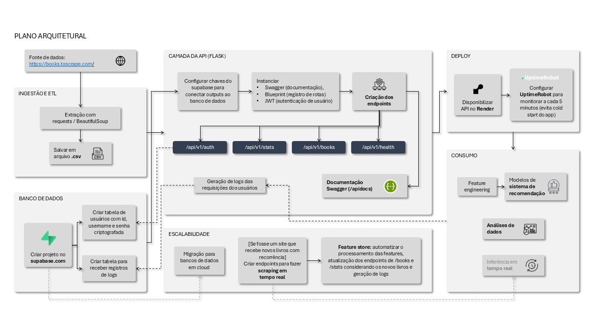
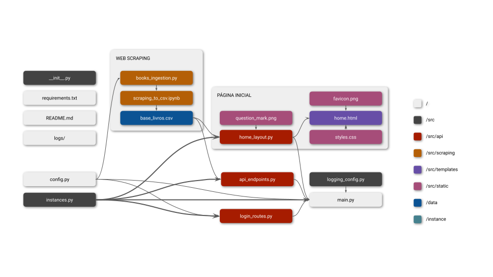

# API para consulta de livros
*Tech Challenge da Fase 1 do curso de [pós-graduação em Engenharia de Machine Learning FIAP](https://postech.fiap.com.br/curso/machine-learning-engineering/)*

> API disponível em https://books-catalog-api.onrender.com/ <br>
> ***Obs:** Embora a fonte de dados possua 1.000 livros, a API retorna 999, pois há um item duplicado.*

## ✨ Sobre o projeto
Este aplicativo é uma **API pública** que fornece dados para realizar análises de dados e alimentar sistemas de recomendação de livros. A estrutura projetada para extrair, transformar e disponibilizar dados de livros a cientistas de dados e modelos de Machine Learning (como sistemas de recomendação).

## ⚙️ Funcionalidades:
- **Web Scraping:**<br>Extrai os dados dos livros (título, preço, rating, disponibilidade, categoria, imagem) do site [Books to scrape](https://books.toscrape.com/) e armazena arquivo `.csv`
- **Operações CRUD:**<br>Endpoints `POST` (para registro do usuário e login para obtenção do token de acesso) e `GET` (para obter dados dos livros)
- **Sistema de autenticação:**<br>Baseado em JWT (JSON Web Tokens). O usuário cria suas credenciais (login e senha) e esses dados de autenticação são persistidos no [Supabase](https://supabase.com/) (PostgreSQL). Ao realizar a autenticação, a API retorna um token que deve ser utilizado para acessar rotas protegidas via `Authorization: Bearer <token>`
- **Documentação:**<br>Obtida automaticamente com Swagger
- **Registro de logs:**<br>As requisições dos usuários são registradas em uma tabela no Supabase para análises de uso da API
- **Monitoramento**<br>A API é monitorada no [UptimeRobot](https://uptimerobot.com/), que executa o endpoint `/api/v1/health` a cada 5 minutos para evitar cold start do app

## 📐 Arquitetura


## 📂 Estrutura do projeto
```
books-catalog-api/
books-catalog-api/
├── README.md
├── requirements.txt
├── main.py
├── config.py
├── src/
│   ├── __init__.py
│   ├── instances.py
│   ├── logging_config.py
│   ├── api/
│   │   ├── api_endpoints.py
│   │   ├── login_routes.py
│   │   └── home_layout.py
│   ├── scraping/
│   │   ├── books_ingestion.py
│   │   └── scraping_to_csv.ipynb
│   ├── templates/
│   │   └── home.html
│   ├── static/
│   │   ├── favicon.png
│   │   ├── github.png
│   │   ├── question_mark.png
│   │   └── styles.css
├── data/
│   └── base_livros.csv
├── diagrams/
│   ├── plano_arquitetural.png
│   ├── estrutura_pastas.png
│   └── fluxograma_modulos.png
└── logs/
```

*Descrição dos arquivos:*


*Como os módulos estão relacionados:*


## 🧭 Rotas da API (Endpoints)

| Endpoint                                                     | Descrição                                                     |
| :----------------------------------------------------------- | :------------------------------------------------------------ |
| `POST /api/v1/auth/register`                                 | Registra um novo usuário recebendo username e password        |
| `POST /api/v1/auth/login`                                    | Gera o token de acesso para acessar rotas protegidas          |
| `GET /api/v1/books` 🔒                                       | Lista todos os livros disponíveis na base de dados.           |
| `GET /api/v1/books/price-range?min={min}&max={max}`          | Filtra livros dentro de uma faixa de preço específica.        |
| `GET /api/v1/books/search?title={title}&category={category}` | Busca livros por título e/ou categoria.                       |
| `GET /api/v1/books/top-rated`                                | Lista os livros com melhor avaliação (rating mais alto).      |
| `GET /api/v1/books/{id}`                                     | Retorna detalhes completos de um livro específico pelo ID.    |
| `GET /api/v1/categories`                                     | Lista todas as categorias de livros disponíveis.              |
| `GET /api/v1/health`                                         | Verifica status da API e conectividade com os dados.          |
| `GET /api/v1/stats/categories`                               | Estatísticas detalhadas por categoria (quantidade de livros, preços por categoria, média de nota). |
| `GET /api/v1/stats/overview`                                 | Estatísticas gerais da coleção (total de livros, preço médio, distribuição de ratings). |

## 📄 Documentação do projeto
A documentação da API é gerada automaticamente com Swagger e pode ser acessada em https://books-catalog-api.onrender.com/apidocs.

## ✅ Instruções para execução com Python

Se não tiver a biblioteca `requests` instalada → executar no terminal `pip install requests`
```
import requests
url = 'https://books-catalog-api.onrender.com'
```

## 🛠️ Exemplos de chamadas com requests/responses

### 1. Registrar usuário
```python
# alterar as chaves para os username e password desejados
username = 'username'
password = 'password'

payload = {'username':username, 'password':password}

resp = requests.post(f"{url}/api/v1/auth/register", json = payload)
print(resp.json())
```

### 2. Fazer login e gerar token de acesso
```python
payload = {'username':username, 'password':password}
resp = requests.post(f"{url}/api/v1/auth/login", json = payload)

# armazenar o token de acesso na variável access_token
access_token = resp.json()['access_token'] 
print(access_token)
```

### 3. Usar token de acesso para obter a lista de livros
> ***Obs:** no `/apidocs`, o token deve ser usado no botão verde "Authorize" (canto superior direito do Swagger) no formato Bearer {token} (sem {})*
```python
header = {'Authorization': f"Bearer {access_token}"}
endpoint_livros = f"{url}/api/v1/books"

# armazenar a lista de livros na variável lista_livros
lista_livros = requests.get(endpoint_livros, headers = header).json()
```

### 4. Overview (obter as estatísticas gerais da coleção)
``` python
# input
overview = f"{url}/api/v1/stats/overview"
resp = requests.get(overview).json()
```

``` python
# output esperado
{'mean_price': 35.07,
 'ratings_distribution': {'1': 226, '2': 196, '3': 203, '4': 179, '5': 195},
 'total_books': 999}
```

### 5. Obter livros de uma faixa de preço
``` python
# colocar no dict os termos de busca (nenhum deles é obrigatório)
params = {'min':20, 'max':25}

price_range = f"{url}/api/v1/books/price-range"
resp = requests.get(price_range, params = params).json()
```

### 6. Pesquisar livros por título e categoria
``` python
# colocar no dict os termos de busca (nenhum deles é obrigatório)
params = {'title':'dog', 'category':''}

search = f"{url}/api/v1/books/search"
resp = requests.get(search, params = params).json()
print(resp)
```

## 💻 Executando o projeto localmente
*Em breve, descrição dos passos:*
- Clonar o repositório
- Configurar Supabase

## 🚀 Evolução da API

**Outros endpoints para sistema de autenticação**
1. `POST /api/v1/auth/refresh` | renovar token
2. `/api/v1/scraping/trigger` | proteger endpoints de admin

**Endpoints para pipeline ML-ready (endpoints para consumo de modelos ML)**
1. `GET /api/v1/ml/features` | dados formatados para features
2. `GET /api/v1/ml/training-data` | dataset para treinamento
3. `POST /api/v1/ml/predictions` | endpoint para receber predições

**Monitoramento e analytics**
1. Métricas de performance da API
2. Dashboard simples de uso (streamlit)

**Escalabilidade**
1. [Se a fonte de dados recebesse novos livros com frequência] Criar endpoints para fazer o scraping dos novos livros e armazenar em banco de dados
2. Construir os endpoints dos livros a partir de queries do banco de dados (atualiza automaticamente listas e stats)
3. Migrar o banco para um servidor em cloud
